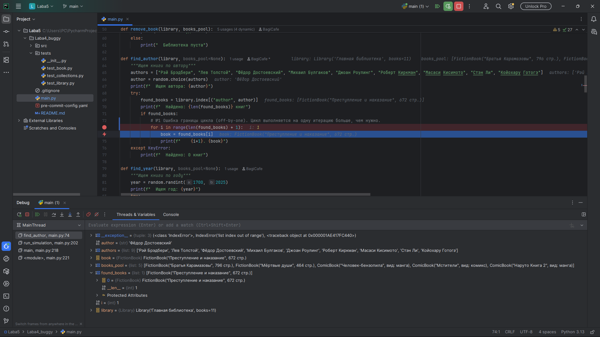
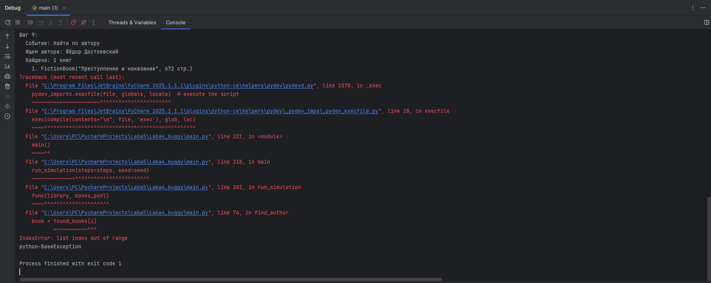
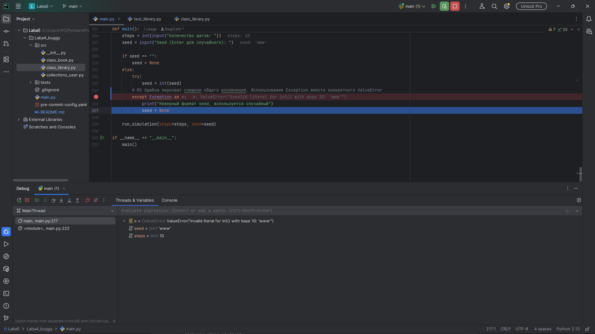
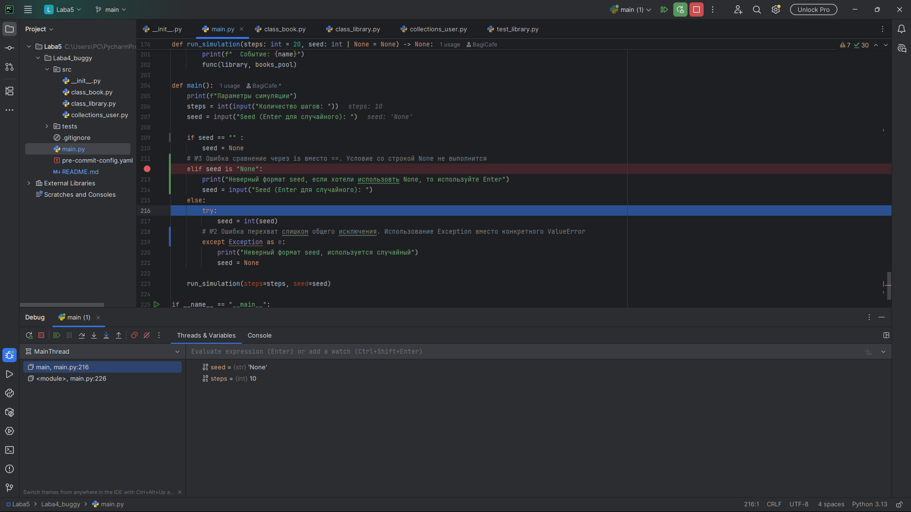
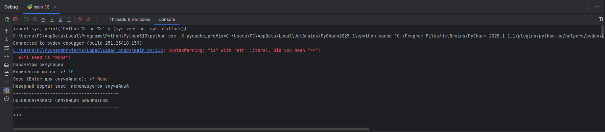
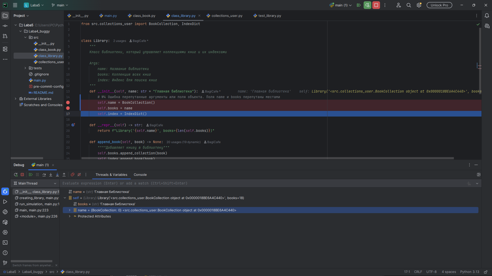
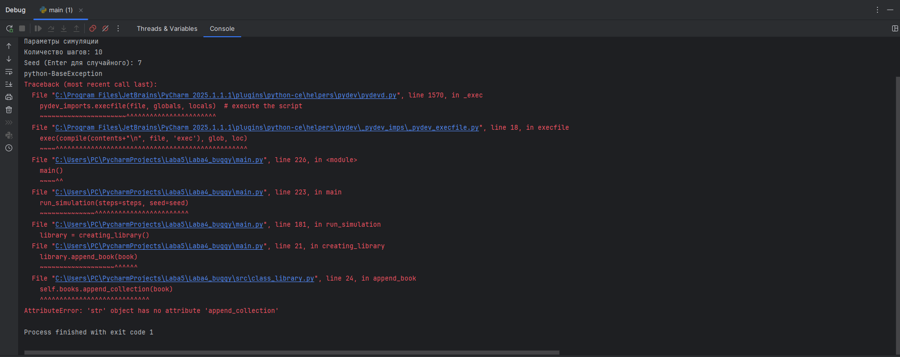
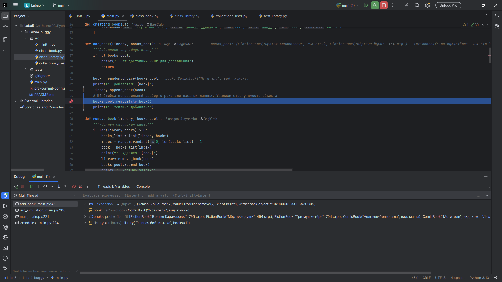
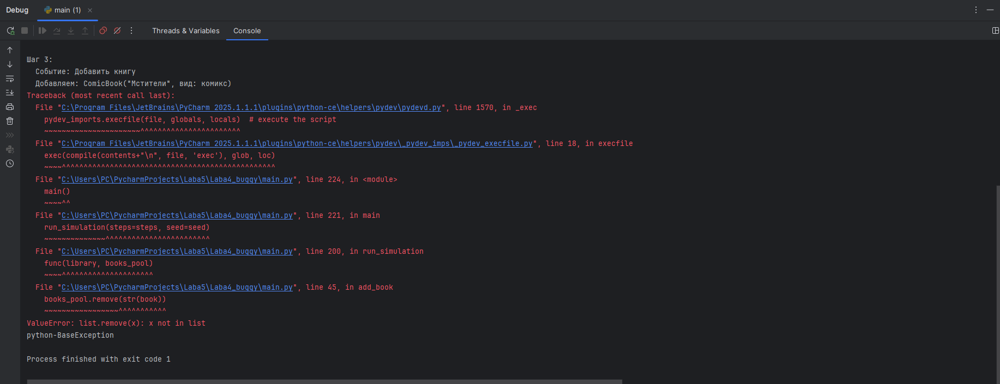

# LABA5 ( Отладĸа ĸодовой базы проеĸта на Python с помощью средств отладĸи)

## Ошибки

### Ошибка 1 - Ошибка границы цикла (off-by-one)
Место : ```main.py```, метод ```find_author```

Симптом:

При поиске книг по автору программа выдает ```IndexError```

Как воспроизвести:

Запустить симуляцию с seed=0 и шагом=10.

Отладка:

Установлен breakpoint на  цикле: ```for i in range(len(found_books) + 1) ```

Причина:

Цикл выполняется на одну итерацию больше, чем нужно

Исправление:

Убрать в цикле + 1 ( ```for i in range(len(found_books))``` )

Доказательства:






### Ошибка 2 - Перехват слишком общего исключения
Место : ```main.py```, метод ```main()```

Симптом:

При вводе некорректного seed программа скрывает детали ошибки

Как воспроизвести:

Запустить симуляцию с seed=www и шагом=10.

Отладка:

Установлен breakpoint на : ```except Exception as e ```

Причина:

Использование ```Exception``` вместо конкретного ```ValueError```

Исправление:

Использовать ```ValueError``` (```except ValueError```)

Доказательства:



Ошибки в командной строке нет


### Ошибка 3 - Сравнение через is вместо ==
Место : ```main.py```, метод ```main()```

Симптом:

При вводе строки "None" программа не распознаёт этот случай

Как воспроизвести:

Запустить симуляцию с seed=None и шагом=10.

Отладка:

Установлен breakpoint на условие: ```elif seed is "None"```

Причина:

```is``` сравнивает идентичность объектов в памяти

Исправление:

Изменить ```is``` на ```==``` (```elif seed == "None"``` )

Доказательства:






### Ошибка 4 - Перепутанные аргументы или поля объекта
Место : ```src/class_book.py```, класс ```Library``` и метод ```__init__```

Симптом:

При создании библиотеки и попытке добавить книгу программа выдает ```AttributeError```

Как воспроизвести:

Запустить симуляцию с seed=7 и шагом=10.

Отладка:

Установлен breakpoint на : ```self.name = BookCollection()``` и ```self.books = name```

Причина:

Неправильная инициализация полей объекта

Исправление:

Поменять местами ```name``` и ```BookCollection()``` (```self.name``` = ```name``` и ```self.books``` = ```BookCollection()```)

Доказательства:






### Ошибка 5 - Неправильный разбор строки или входных данных
Место : ```main.py```, метод ```add_book```

Симптом:

При добавлении книги программа выдвет ```ValueError```

Как воспроизвести:

Запустить симуляцию с seed=1 и шагом=10.

Отладка:

Установлен breakpoint на : ```books_pool.remove(str(book))```

Причина:

Попытка удалить строковое представление объекта из списка, содержащего объекты

Исправление:

Не использовать ```str``` (```books_pool.remove(book)```)

Доказательства:




